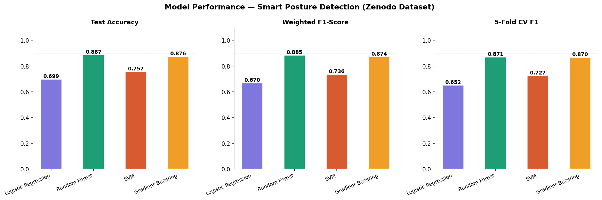
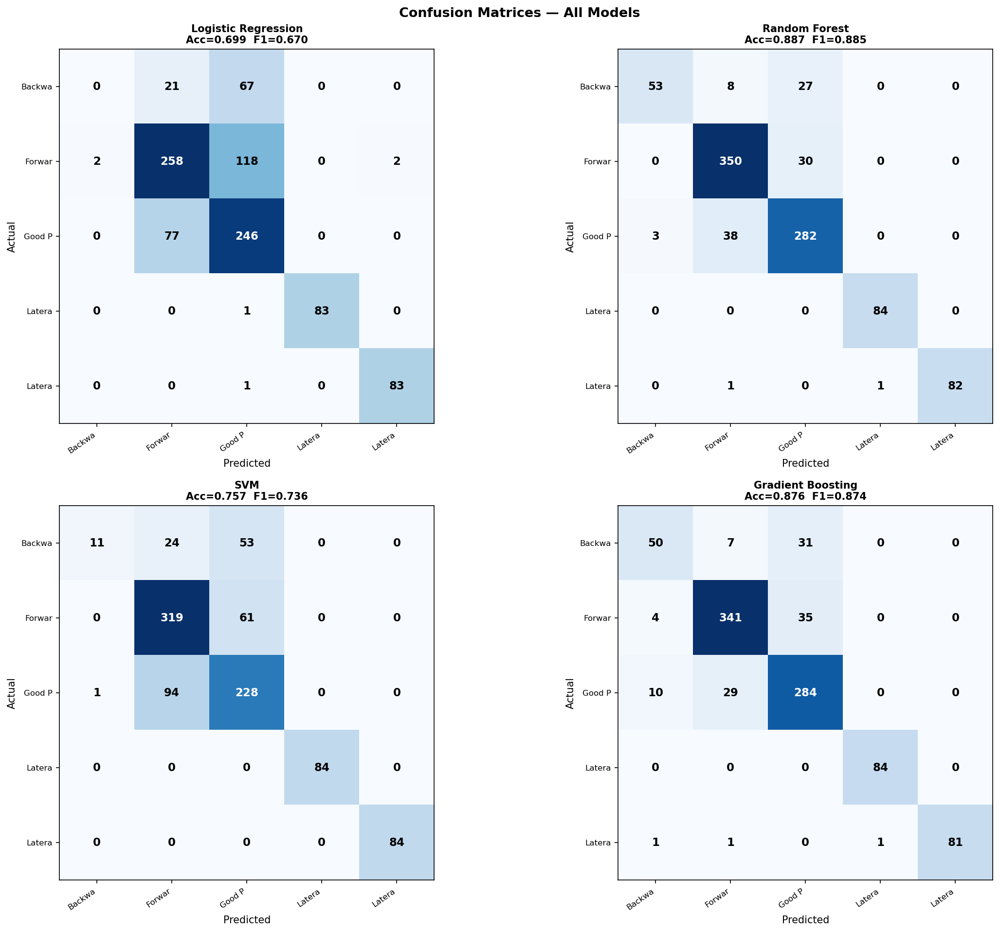
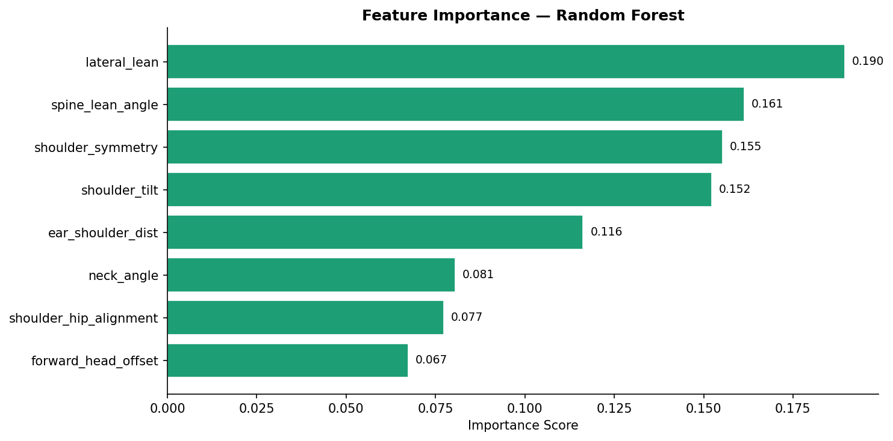
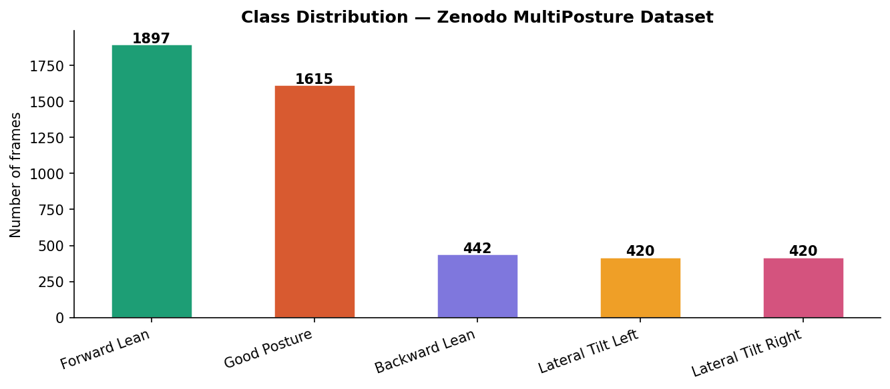

# Smart Posture Detection & Musculoskeletal Health Risk Prediction
---

## Overview

Poor posture is a leading cause of musculoskeletal issues, especially for desk workers and students. I built this project to explore how classical ML models can classify posture from body landmark data and translate that into actionable health risk scores — all through an interactive web app.

The system classifies 5 upper-body posture types, compares 4 ML models head-to-head, and provides a health dashboard with session history and cumulative risk tracking.

---

## App Demo

The app has 4 pages:

| Page | Description |
|------|-------------|
| **Home & Demo** | Manual slider analysis + simulated live posture session |
| **Model Comparison** | Performance charts for all 4 trained models |
| **Health Dashboard** | Session history, risk score timeline |
| **About** | Project documentation and methodology |

---

## Results

I trained and evaluated 4 ML models on the Zenodo MultiPosture Dataset (4,794 real frames from 13 participants):

| Model | Accuracy | F1 Score | CV F1 |
|-------|----------|----------|-------|
| Logistic Regression | 69.9% | 0.670 | 0.652 |
| SVM (RBF) | 75.7% | 0.736 | 0.727 |
| Gradient Boosting | 87.6% | 0.874 | 0.870 |
| **Random Forest** | **88.7%** | **0.885** | **0.871** |

**Random Forest was selected as the best model**, achieving 88.7% accuracy with a 5-fold cross-validated F1 of 0.871.

### Model Comparison Chart


### Confusion Matrices


### Feature Importance


### Class Distribution


---

## Project Structure

```
smart-posture-detection/
│
├── app.py                  ← Streamlit web app (run this!)
├── train_models.py         ← Train & compare all 4 ML models
├── generate_dataset.py     ← Dataset preprocessing pipeline
├── requirements.txt        ← All dependencies
├── features.py             ← Biomechanical Feature Engineering
|
│
│
├── data/
│   ├── data.csv            ← Raw Zenodo landmark dataset
│   └── features.csv        ← Engineered features
│
├── models/                 ← Saved trained models
│   ├── best_model.pkl      ← Random Forest (best performer)
│   ├── all_models.pkl      ← All 4 models
│   ├── scaler.pkl          ← StandardScaler
│   ├── classes.pkl         ← Label classes
│   └── model_summary.json  ← Accuracy/F1 results
│
└── screenshots/            ← Training output plots
    ├── class_distribution.png
    ├── model_comparison.png
    ├── confusion_matrices.png
    └── feature_importance.png
```

---

## How It Works

### 1. Feature Engineering
Rather than feeding raw landmark coordinates directly into the model, I engineered **8 biomechanical features** that better capture posture geometry:

| Feature | What it captures |
|---------|-----------------|
| `neck_angle` | Forward/backward neck tilt |
| `shoulder_tilt` | Shoulder unevenness |
| `spine_lean_angle` | Overall spine inclination |
| `forward_head_offset` | Head protrusion relative to shoulders |
| `shoulder_hip_alignment` | Vertical alignment of torso |
| `ear_shoulder_dist` | Ear-to-shoulder distance ratio |
| `shoulder_symmetry` | Left-right shoulder balance |
| `lateral_lean` | Side-to-side body lean |

### 2. Posture Classification

| Code | Class | Health Risk |
|------|-------|-------------|
| TUP | Good Posture | 🟢 Low |
| TLF | Forward Lean | 🔴 High |
| TLB | Backward Lean | 🟡 Medium |
| TLL | Lateral Tilt Left | 🟡 Medium |
| TLR | Lateral Tilt Right | 🟡 Medium |

### 3. Training Pipeline
```
Raw landmark CSV → Feature engineering → Train/test split (80/20)
→ 5-fold stratified cross-validation → Best model selection → Saved as .pkl
```


## Tech Stack

- **ML:** scikit-learn (Random Forest, Gradient Boosting, SVM, Logistic Regression)
- **Pose Estimation:** MediaPipe Pose (landmark extraction)
- **Web App:** Streamlit
- **Data:** Zenodo MultiPosture Dataset — 4,794 frames, 13 participants, 99 coordinates/frame
- **Language:** Python 3.10+

---

## Dataset

**Zenodo MultiPosture Dataset** (record [14230872](https://zenodo.org/record/14230872))  
Real MediaPipe Pose Heavy landmarks captured from 13 participants across 5 upper-body posture positions.

---

*Built by Abdullah · BS Robotics & Intelligent Systems · Bahria University Islamabad*
